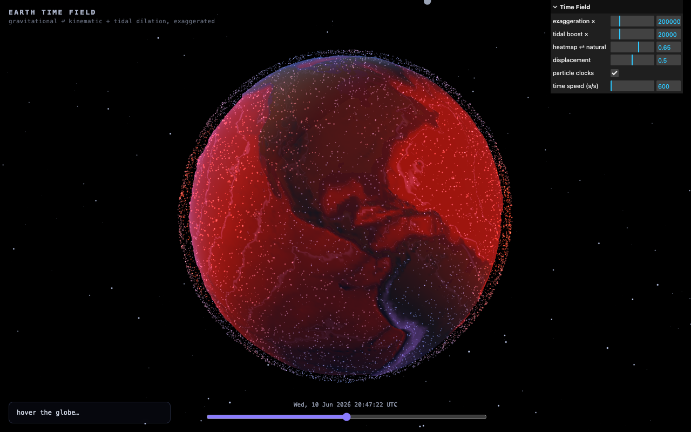

# Earth Time Field

Interactive 3D visualization of how time itself runs at different rates across
Earth — gravitational, kinematic, and tidal relativistic effects, exaggerated
until they're visible.

Time runs ~168 ns/day slower at the bottom of the Mariana Trench and
~83 ns/day faster on Everest's summit than at sea level. The equator's spin
costs another ~104 ns/day versus the poles. This project turns those invisible
numbers into a living field on a real-topography globe.



## Quick start

```sh
# 1. data pipeline (real ETOPO1-derived elevation + bathymetry, no API key)
./pipeline/run.sh            # or --synthetic if offline

# 2. web app
cd web
bun install
bun run dev                  # open http://localhost:5173
```

Hover the globe for a per-location breakdown (gravity / rotation / tides in
ns per day). Drag the exaggeration slider from 1× (reality: nothing visible)
to 1,000,000×. The sun and moon follow a real ephemeris — scrub the timeline
±6 months and watch the terminator and tidal bulge move.

## Architecture

| Layer | Where | Role |
|---|---|---|
| The Clock | `web/src/timeField.js` + `FIELD_GLSL` | evaluates time-rate deviation (ps/s) at any point |
| The Stage | `pipeline/` | real elevation → 16-bit heightmap + GLB (pure Python) |
| The Lens | `web/src/shaders.js`, `main.js` | heatmap / displacement / particle-clock rendering |

See [AGENTS.md](AGENTS.md) for conventions and [PLAN.md](PLAN.md) for the roadmap.
